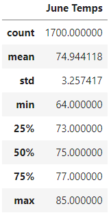
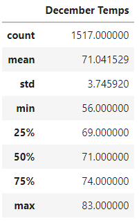

# Surf's Up: Oahu Weather in June and December
---
## Overview
### This is an analysis of the weather readings in Oahu, Hawaii for the months of June and December to help W. Avy gauge the viability of a new investment prospect. By analyzing the temperature readings of local weather stations in June and December, we can better predict the highs and lows of patronage to a surfing and ice cream business during the summer and winter months.  

## Results
The statistics for June and December temperatures are in the following tables:

- June temperatures have been recorded 1,700 times from 2010 to 2017, while December temperatures have  been recorded only 1,517 times from 2010 to 2016.
- June has an average temperature of 75 degrees, with a recorded maximum of 85 and minimum of 64.
- December has an average temperature of 71 degrees, with a recorded maximum of 83 and minimum of 56.

## Summary
The temperature on Oahu is fairly consistent throughout the year with only a 3 degree difference in average temperature for June and December. December has 183 less readings than June, but this is due to the December 2017 readings having not been included in the source data. Although December's minimum temperature (56) is eight degrees lower than June's (64), the lower quartile of temperatures in December is only four degrees colder than June's lower quartile, indicating that the cooler December days are generally not too much colder than June's cooler days and 56 degrees is an outlier.

To further investigate June and December's weather, I would run additional queries on the precipitation measurements for these specific months to see how rain could effect the summer versus winter sales. I would also query the locations of the weather stations to see to what parts of the island they recorded their weather readings. By narrowing down the readings to only those  stations closest to the shop's planned location, irrelevant data can be limited, such as weather conditions on the far side of the island.